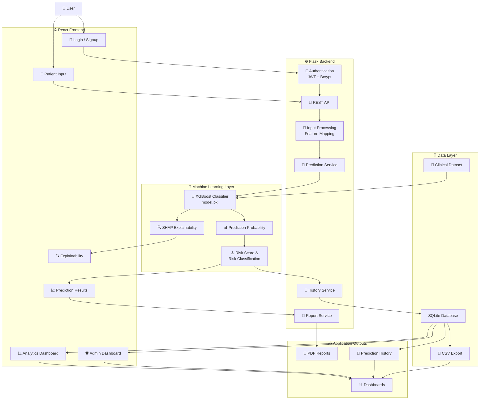

# 🩺 AI Cancer Care — Risk & Recurrence Prediction

<p align="center">
  
</p>

<h2 align="center">
  AI-Powered Cancer Risk & Recurrence Analysis
</h2>

<p align="center">
  Machine Learning • Explainable AI • React • Flask • XGBoost
</p>

<p align="center">
  <a href="https://github.com/meganathm123-lgtm/AI-Cancer-Care-Recurrence-Prediction">
    
  </a>
  
  
  
  
</p>

<p align="center">
  
  
</p>

---

## 🧬 Project Overview

**AI Cancer Care** is a full-stack machine-learning application designed to analyze structured clinical information and estimate cancer recurrence risk.

The project combines a machine-learning model with a complete web application containing:

- 🤖 Machine Learning
- 🔍 Explainable AI
- 🌐 React frontend
- ⚙️ Flask backend
- 🔐 Authentication
- 🗄️ SQLite data storage
- 📊 Analytics dashboards
- 📄 Prediction reports
- 📈 Risk visualization
- 👤 Patient prediction history

The main objective is to demonstrate how a machine-learning model can be integrated into a complete software system rather than being used only as an isolated prediction script.

> ⚠️ **This is an academic/research prototype. It must not be used for medical diagnosis, prognosis, or treatment decisions.**

---

# 🎯 Problem Statement

Cancer recurrence analysis can involve multiple clinical factors, including:

- Age
- Gender
- Tumor characteristics
- Cancer stage
- Treatment
- Lymph-node information
- Tumor grade
- Family history
- Smoking history

Processing these factors manually can make it difficult to provide a consistent software-based analysis workflow.

This project explores a machine-learning-based approach where structured clinical information is processed by a trained model and transformed into a prediction probability and risk classification.

### The system is designed to:

- Process structured clinical information
- Generate a machine-learning prediction
- Calculate prediction probability
- Generate a risk score
- Classify risk level
- Provide explainability information
- Store prediction records
- Display analytics
- Generate downloadable reports

---

# 💡 Solution

The application connects the frontend, backend, machine-learning model and database into a single workflow.

```text
┌──────────────────────────┐
│     Clinical Inputs      │
└────────────┬─────────────┘
             ↓
┌──────────────────────────┐
│ Data Mapping &           │
│ Preprocessing            │
└────────────┬─────────────┘
             ↓
┌──────────────────────────┐
│      XGBoost Model       │
└────────────┬─────────────┘
             ↓
┌──────────────────────────┐
│ Probability / Prediction │
└────────────┬─────────────┘
             ↓
┌──────────────────────────┐
│ Risk Score &             │
│ Risk Classification      │
└────────────┬─────────────┘
             ↓
┌──────────────────────────┐
│      Explainability      │
└────────────┬─────────────┘
             ↓
┌──────────────────────────┐
│ SQLite Prediction        │
│ Storage                  │
└────────────┬─────────────┘
             ↓
┌──────────────────────────┐
│ Dashboard & Reports      │
└──────────────────────────┘
```

---

# ✨ Key Features

<table>
<tr>
<td width="50%" valign="top">

## 🤖 Machine Learning

- Cancer recurrence prediction
- XGBoost classifier
- Probability-based prediction
- Risk classification
- Model training pipeline
- Model evaluation

</td>

<td width="50%" valign="top">

## 🔍 Explainable AI

- SHAP-based explanation workflow
- Feature contribution information
- Explainability interface
- Clinical feature visualization
- Model interpretation

</td>
</tr>

<tr>
<td width="50%" valign="top">

## 🔐 Authentication

- User registration
- User login
- JWT authentication
- Bcrypt password hashing
- Protected prediction workflow

</td>

<td width="50%" valign="top">

## 📊 Analytics

- Prediction statistics
- Risk distribution
- Cancer-type analysis
- Prediction trends
- Admin dashboard

</td>
</tr>

<tr>
<td width="50%" valign="top">

## 👤 Patient Workflow

- Clinical information input
- Prediction results
- Risk score
- Confidence information
- Prediction history

</td>

<td width="50%" valign="top">

## 📄 Reports

- PDF prediction reports
- Patient summary
- Risk summary
- Clinical information
- CSV data export

</td>
</tr>
</table>

---

# 🧠 Machine Learning

## Model

The current prediction workflow uses an **XGBoost Classifier (`XGBClassifier`)**.

During development, **Random Forest** and **XGBoost** were evaluated.

### Current XGBoost Configuration

```python
XGBClassifier(
    n_estimators=150,
    max_depth=4,
    learning_rate=0.1,
    eval_metric="logloss",
    random_state=42
)
```

---

# 🧬 Input Features

The training pipeline uses the following clinical features:

```text
Age
Gender
Radius
Area
Concavity
Stage
Treatment
Lymph
Grade
Family History
Smoking
```

Categorical values are converted into numerical representations before being passed to the machine-learning model.

---

# 🔬 Machine Learning Pipeline

```text
Clinical Dataset
       │
       ▼
Data Loading
       │
       ▼
Data Cleaning
       │
       ▼
Categorical Encoding
       │
       ▼
Feature Selection
       │
       ▼
Train / Test Split
       │
       ▼
XGBoost Training
       │
       ▼
Model Evaluation
       │
       ▼
model.pkl
       │
       ▼
Flask Prediction API
       │
       ▼
Risk Analysis
```

---

# 📈 Model Evaluation

The training workflow evaluates the model using:

| Metric | Purpose |
|---|---|
| Accuracy | Overall prediction correctness |
| Precision | Correctness of positive predictions |
| Recall | Ability to identify positive cases |
| F1-Score | Balance between precision and recall |
| Classification Report | Detailed class-level evaluation |

Model performance should be interpreted as **machine-learning evaluation results**, not clinical validation.

> Clinical deployment would require substantially larger datasets, external validation, domain-specific evaluation and appropriate regulatory and medical review.

---

# 🔍 Explainable AI

The application includes an explainability workflow to provide information about how input features contribute to a prediction.

```text
Clinical Features
       │
       ▼
Machine Learning Model
       │
       ▼
Prediction
       │
       ▼
Feature Contributions
       │
       ▼
Explainability Data
       │
       ▼
Frontend Visualization
```

The project uses **SHAP (SHapley Additive exPlanations)** as part of this workflow.

---

# 🏗️ System Architecture



---

# 🛠️ Technology Stack

## 💻 Frontend

<p align="center">
  
</p>

```text
React
JavaScript
HTML5
CSS3
React Router
Chart.js
React Icons
React Hot Toast
jsPDF
Firebase
```

---

## ⚙️ Backend

<p align="center">
  
</p>

```text
Python
Flask
Flask-CORS
Flask-JWT-Extended
Bcrypt
SQLite
REST APIs
```

---

## 🤖 Machine Learning

```text
XGBoost
Scikit-learn
Pandas
NumPy
Joblib
SHAP
Random Forest
```

---

## 🧰 Development Tools

<p align="center">
  
</p>

```text
Git
GitHub
VS Code
Linux
```

---

# 📂 Project Structure

```text
AI-Cancer-Care-Recurrence-Prediction/
│
├── backend/
│   ├── app.py
│   ├── model.pkl
│   ├── train_model.py
│   ├── users.json
│   │
│   └── templates/
│       ├── home.html
│       ├── input.html
│       ├── result.html
│       ├── admin.html
│       ├── analytics.html
│       └── feature_importance.html
│
├── frontend/
│   ├── public/
│   ├── src/
│   │   ├── components/
│   │   ├── assets/
│   │   ├── styles/
│   │   ├── Admin.js
│   │   ├── AdminDashboard.js
│   │   ├── Analytics.js
│   │   ├── Clinical.js
│   │   ├── Explainability.js
│   │   ├── Home.js
│   │   ├── Login.js
│   │   ├── Patient.js
│   │   ├── Result.js
│   │   └── Signup.js
│   │
│   └── package.json
│
├── data/
│   └── cancer_data_extended.csv
│
├── requirements.txt
├── LICENSE
├── .gitignore
└── README.md
```

---

# 🚀 Getting Started

## 1. Clone the Repository

```bash
git clone https://github.com/meganathm123-lgtm/AI-Cancer-Care-Recurrence-Prediction.git
cd AI-Cancer-Care-Recurrence-Prediction
```

---

# 🐍 Backend Setup

## Create Virtual Environment

```bash
python -m venv venv
```

### Windows

```bash
venv\Scripts\activate
```

### Linux / macOS

```bash
source venv/bin/activate
```

---

## Install Dependencies

```bash
pip install -r requirements.txt
```

---

## Start Flask Backend

```bash
python backend/app.py
```

Backend:

```text
http://localhost:5000
```

---

# ⚛️ Frontend Setup

Open a second terminal.

```bash
cd frontend
```

Install dependencies:

```bash
npm install
```

Start the React application:

```bash
npm start
```

Frontend:

```text
http://localhost:3000
```

---

# 🔌 API Routes

| Endpoint | Method | Purpose |
|---|---|---|
| `/api` | GET | Backend health/status |
| `/signup` | POST | Register a user |
| `/login` | POST | Authenticate a user |
| `/predict` | POST | Generate prediction |
| `/admin` | GET | Admin dashboard |
| `/analytics` | GET | Analytics dashboard |
| `/admin-data` | GET | Admin statistics |
| `/analytics-data` | GET | Analytics data |
| `/download-pdf` | POST | Generate prediction PDF |
| `/download-csv` | GET | Export prediction data |
| `/save_history` | POST | Save prediction history |
| `/get_history` | GET | Retrieve prediction history |

---

# 🔄 Application Workflow

```text
                         USER
                           │
                           ▼
                  ┌─────────────────┐
                  │ Registration /  │
                  │ Login           │
                  └────────┬────────┘
                           │
                           ▼
                  ┌─────────────────┐
                  │ Clinical Input  │
                  └────────┬────────┘
                           │
                           ▼
                  ┌─────────────────┐
                  │   Flask API     │
                  └────────┬────────┘
                           │
                           ▼
                  ┌─────────────────┐
                  │    XGBoost      │
                  │    Prediction   │
                  └────────┬────────┘
                           │
                           ▼
              ┌──────────────────────────┐
              │ Risk Score               │
              │ Risk Level               │
              │ Confidence               │
              │ Explanation Information  │
              └────────────┬─────────────┘
                           │
                    ┌──────┴──────┐
                    │             │
                    ▼             ▼
             ┌────────────┐  ┌────────────┐
             │ Dashboard  │  │ PDF Report │
             └────────────┘  └────────────┘
```

---

# 📊 Application Modules

## 🏠 Home

Landing page for the AI Cancer Care application.

---

## 👤 Patient

Provides the clinical information entry and prediction workflow.

---

## 📈 Results

Displays prediction-related information including:

- Risk level
- Risk score
- Confidence
- Prediction interpretation
- Clinical features

---

## 🔍 Explainability

Provides feature contribution information associated with the prediction.

---

## 📊 Analytics

Provides analytical views such as:

- Risk distribution
- Cancer-type distribution
- Prediction statistics
- Prediction trends

---

## 🛡️ Admin Dashboard

Provides administrative views including:

- Total predictions
- Risk distribution
- Recent prediction records
- Analytics information

---

## 📄 Reports

Provides downloadable prediction reports containing relevant patient and prediction information.

---

# 🔐 Authentication & Security

The current implementation includes:

```text
JWT Authentication
Bcrypt Password Hashing
Protected Prediction Workflow
CORS Configuration
Environment Variable Loading
User Authentication
```

For production healthcare applications, additional security controls would be required, including stronger access management, encryption, auditing, privacy controls and appropriate regulatory compliance.

---

# 🗃️ Data Storage

The application currently uses **SQLite** for prediction records.

Prediction-related information can include:

```text
Patient ID
Cancer Type
Age
Gender
Tumor Information
Stage
Treatment
Lymph Nodes
Grade
Family History
Smoking
Risk Score
Risk Level
Timestamp
```

The application also provides CSV export functionality for prediction records.

---

# 📄 Prediction Reports

The application includes a prediction report workflow that can contain:

```text
Patient ID
Date & Time
Clinical Information
Risk Level
Risk Score
Clinical Interpretation
Medical Disclaimer
```

---

# 🔮 Future Improvements

Potential future development directions include:

- Improved Model Validation
- Multi-Cancer Specialized Models
- PostgreSQL Integration
- Cloud Deployment
- Advanced Authentication
- Doctor-Focused Dashboard
- Patient Assistance Chatbot
- Notification Services
- Model Monitoring
- Improved Explainability
- Mobile Application
- Larger Clinical Datasets

---

# 🧪 Research & Engineering Focus

This project explores the intersection of:

- Artificial Intelligence
- Machine Learning
- Explainable AI
- Healthcare Technology
- Risk Prediction
- Full-Stack Development
- REST APIs
- Data Visualization
- Human-Centered Interfaces

---

# ⚠️ Medical Disclaimer

This project is developed for **academic learning, research and software-engineering demonstration purposes**.

The predictions generated by this application should **not** be considered:

- Medical advice
- Medical diagnosis
- Prognosis
- Treatment recommendations

Real clinical decisions must always involve qualified healthcare professionals and appropriate clinical evaluation.

---

# 👨‍💻 Developer

<p align="center">

<strong>Meganath M</strong>

<br>

Computer Science & Engineering

<br>

Artificial Intelligence & Machine Learning

</p>

---

# 📄 License

This project is licensed under the **MIT License**.

---

<p align="center">

<strong>🩺 AI Cancer Care</strong>

<br><br>

<em>
Exploring the intersection of Artificial Intelligence,
Explainable Machine Learning and Full-Stack Engineering.
</em>

<br><br>

⭐ If you find this project interesting, consider starring the repository.

</p>
